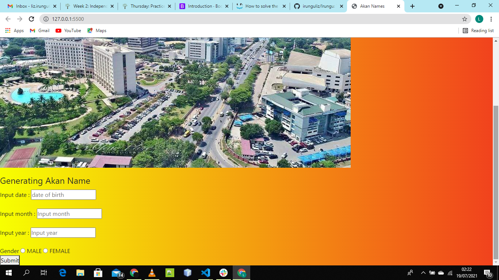

# Introduction to the name generator
## This name generator was created and designed by Liz Irungu on 19/07/2021.
# Project Description
This is a project that performs a task of taking an input which is your date of birth and finding out the exact day you were born and using this day and your gender it generates an Akan name.

# Setup Instructions
To use this name generator all you need is to input your date of birth and your gender.
# Technology used
* Html
* Css
* Bootstrap
* Javascript
# Website requirements
* Chrome browser
* Github
* Internet connection
# Bugs
It runs properly as long as you have strong network connection.
# Live link to my name generator
<a href="https://irunguliz.github.io/Irungu/"> my name generator</a>

# Generator image

# Behaviour Driven Development
| Behaviour | Input example  | output example  |
| :---:   | :-: | :-: |
| Generates day of the week born | (d) = ( ( (CC/4) -2*CC-1) + ((5*YY/4) ) + ((26*(MM+1)/10)) + DD ) mod 7 | Friday|
|Gives a male Akan name | Monday | Kwadwo|
|Gives a female Akan name| Tuesday| Abenaa|

# Contact information
To reach me you can find me here 0727566767
# License
MIT License

Copyright (c) 2021 Liz Wangari Irungu

Permission is hereby granted, free of charge, to any person obtaining a copy
of this software and associated documentation files (the "Software"), to deal
in the Software without restriction, including without limitation the rights
to use, copy, modify, merge, publish, distribute, sublicense, and/or sell
copies of the Software, and to permit persons to whom the Software is
furnished to do so, subject to the following conditions:

The above copyright notice and this permission notice shall be included in all
copies or substantial portions of the Software.

THE SOFTWARE IS PROVIDED "AS IS", WITHOUT WARRANTY OF ANY KIND, EXPRESS OR
IMPLIED, INCLUDING BUT NOT LIMITED TO THE WARRANTIES OF MERCHANTABILITY,
FITNESS FOR A PARTICULAR PURPOSE AND NONINFRINGEMENT. IN NO EVENT SHALL THE
AUTHORS OR COPYRIGHT HOLDERS BE LIABLE FOR ANY CLAIM, DAMAGES OR OTHER
LIABILITY, WHETHER IN AN ACTION OF CONTRACT, TORT OR OTHERWISE, ARISING FROM,
OUT OF OR IN CONNECTION WITH THE SOFTWARE OR THE USE OR OTHER DEALINGS IN THE
SOFTWARE.